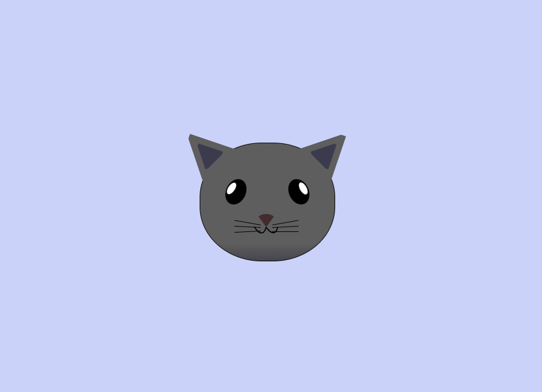

# 🐱 CSS Positioning Cat Painting

A playful yet technical CSS project that showcases my **HTML structure** and **CSS positioning skills** by painting a stylized **cat head** purely with HTML and CSS — no images, no SVGs, just code.



---

## ✨ What This Project Demonstrates

This project focuses on **precise element positioning** using:

- `absolute` and `relative` positioning
- Layering elements with `z-index`
- Shape creation using `border` and `border-radius`
- Symmetry and mirroring with `transform: rotate()`
- Hierarchical selectors and class targeting
- Creating complex visuals without any external graphics

---

## 📁 Project Structure

```bash
css-positioning-cat-painting/
├── .gitignore
├── images/
│   └── preview.png          # Screenshot of the rendered cat head
├── index.html               # HTML structure of the cat head
├── styles.css               # All CSS styling and positioning logic
├── LICENSE                  # MIT License
└── README.md                # You're reading it!
```

## 🚀 How to Run
1. Clone the repository:
    ```
    git clone https://github.com/your-username/css-positioning-cat-painting.git
    cd css-positioning-cat-painting
    ```
2. Open `index.html` in any modern browser:
    ```
    open index.html       # macOS
    xdg-open index.html   # Linux
    start index.html      # Windows
    ```

You’ll see a fully styled cat head centered on the page.

## 💡 Key CSS Techniques Used
- position: absolute for exact placement of each cat feature

- Triangle and ear shapes using CSS borders

- Layering with z-index to achieve visual depth

- Precise alignment and symmetry through transform: rotate()

- Scoped styling via descendant selectors (e.g., .cat-mouth div)


## 👨‍💻 Author
Dr.rer.nat Joseph Karianjahi Njeri

## 📄 License
This project is licensed under the MIT License.

## 🙌 Acknowledgments
Inspired by the freeCodeCamp curriculum — where creativity meets clean code!